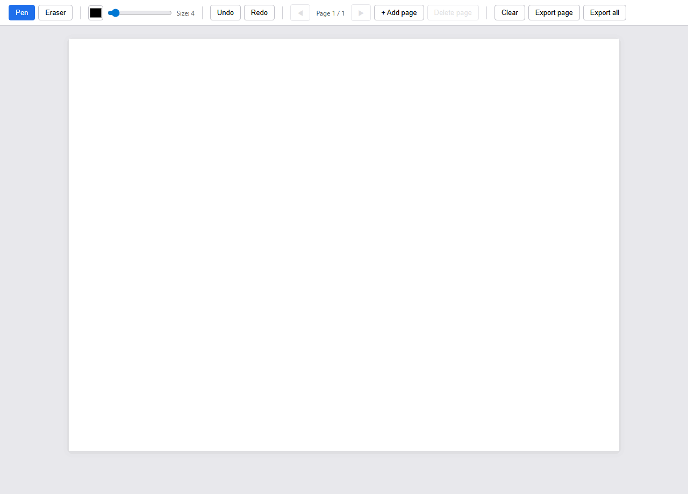

# matcoc-draw

A small, local, no-friction drawing surface that runs entirely in the browser. No accounts, no backend, no cloud sync. Pen, eraser, undo/redo, clear, multi-page documents, export PNG.



Built with Vite + TypeScript, designed via [`PRD.md`](./PRD.md), implemented test-first.

> 📖 **Using the app?** Read the **[User Guide](./USER_GUIDE.md)** — full tour of every toolbar control, keyboard shortcut, and behavior, with screenshots.

## Run it

```bash
npm install
npm run dev
```

Open the URL Vite prints (defaults to http://localhost:5173).

## Build

```bash
npm run build      # type-check + production bundle into dist/
npm run preview    # serve the production build locally
```

## Test

```bash
npm test           # run the suite once
npm run test:watch # watch mode
```

38 unit tests cover the pure-logic modules (`History`, `ToolState`, `Shortcuts`, `Pages`). The DOM-bound `CanvasSurface` is verified manually — see [issue #6](https://github.com/nazmul87-wq/matcoc-draw/issues/6).

## Features

- Freehand pen with adjustable color (native picker) and size (1–50)
- Eraser via `globalCompositeOperation = 'destination-out'` — preserves PNG transparency
- Undo / redo with a 20-snapshot history cap, **per page**
- Multi-page documents (up to 10 pages) with prev/next navigation, add, and delete
- Clear canvas with confirmation (the clear itself is undoable)
- Export the current page or every page as separate PNGs to timestamped filenames
- Pointer Events with `setPointerCapture` — single code path for mouse, stylus, and touch
- DPR-scaled canvas — crisp on HiDPI displays

## Keyboard shortcuts

| Keys | Action |
|---|---|
| `Ctrl/Cmd+Z` | Undo |
| `Ctrl/Cmd+Shift+Z` | Redo |
| `B` | Pen |
| `E` | Eraser |
| `[` / `]` | Decrease / increase brush size |
| `PageUp` / `PageDown` | Previous / next page |

Shortcuts are suppressed when focus is inside an input element.

## Project layout

```
src/
├── main.ts          wiring: builds toolbar, instantiates modules, connects events
├── canvas.ts        CanvasSurface: DPR scaling, pointer events, stroke rendering, export
├── history.ts       undo/redo stack of ImageData snapshots, capped at 20
├── pages.ts         Pages: ordered list of {snapshot, history}, capped at 10
├── tools.ts         ToolState: current tool, color, size; observable
├── shortcuts.ts     keyboard handler with input-focus guard
└── style.css
```

See [`PRD.md`](./PRD.md) for the full design and the decisions behind each piece.
